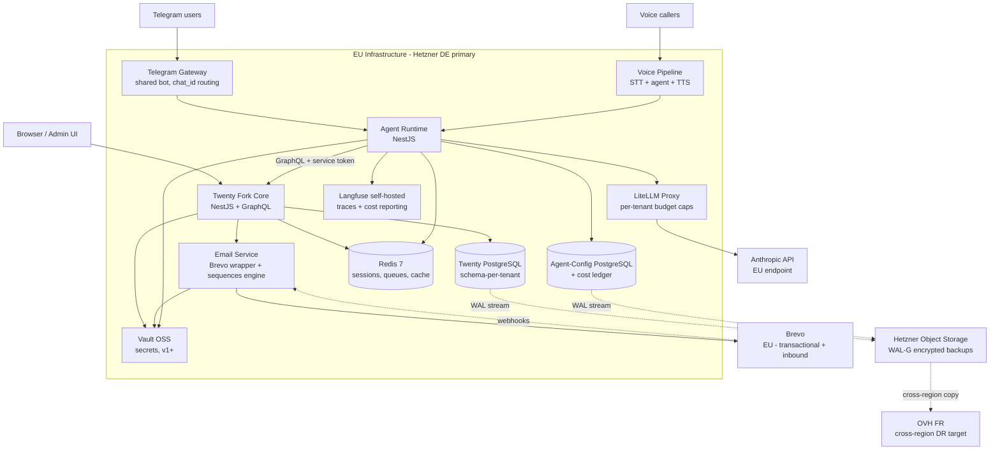
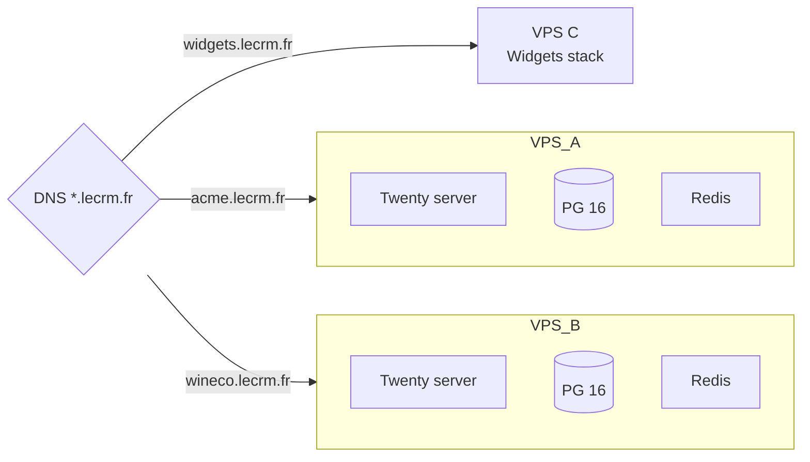
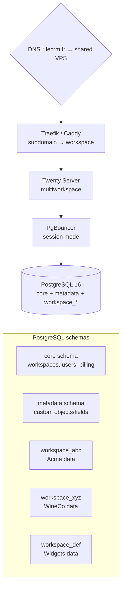
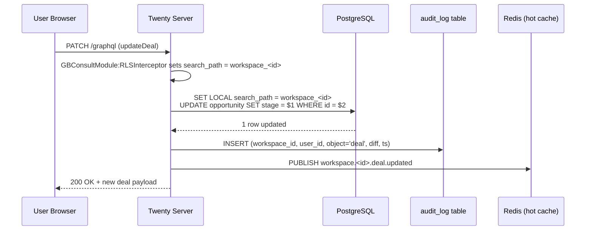
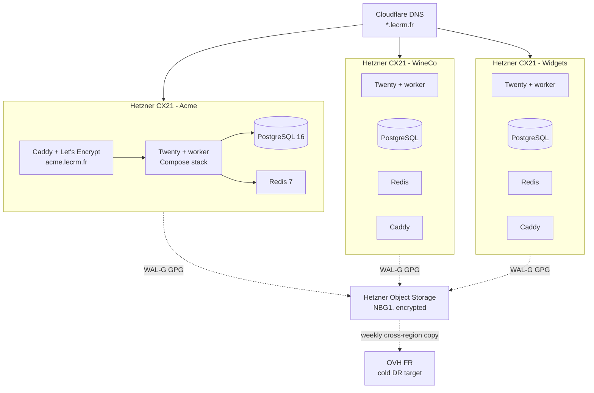
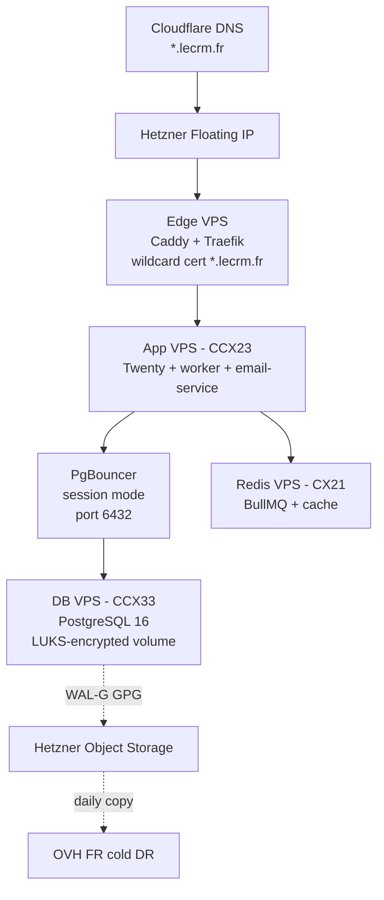
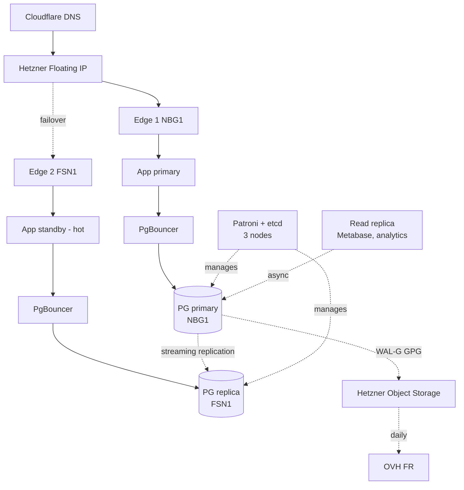

# leCRM Architecture

**Status:** ⚠️ **PENDING REWRITE — describes a foundation no longer being built**
**Date:** 2026-05-10
**Maintainer:** Guillaume (GB Consult)
**Audience:** Any developer joining the project cold. No prior context assumed beyond "leCRM is a managed CRM-as-a-service for French/EU SMBs."

> **This document describes the Twenty-fork architecture.** On 2026-05-10 the project pivoted to **clean-room reimplementation** (Path D — see [ADR-008](adr/ADR-008-clean-room-reimplementation.md)). The current document remains reference-only. A substantial rewrite will follow once stack selection lands (ADR-009, primed by the stack-research tasket). What survives unchanged: the tenancy migration path (ADR-001), email provider (ADR-003), backup/DR posture (ADR-006), encryption/secrets/audit principles (ADR-007), and AI-agent tenancy patterns (ADR-005). What changes: every reference to the Twenty fork, Twenty's stack (NestJS / TypeORM / GraphQL / React), fork rebase cadence, AGPL §13 obligations, and the `gbconsult/` DI module. Sections 2, 4, and 8.7 are most affected.

---

## 1. Purpose

leCRM is a managed CRM-as-a-service for French and EU small businesses (3–15 users per client). It is built on a shallow AGPL fork of [Twenty CRM](https://github.com/twentyhq/twenty) (NestJS backend, PostgreSQL, React frontend) and operated end-to-end by GB Consult: hosting, customization, support, security. The strategic differentiator is **complete UI freedom enabled by AGPL source access** — the long-term product surface is chatbot-driven, voice-driven, and AI-agent-driven CRM that HubSpot's API rate limits make structurally impossible (see `docs/STRATEGIC-OVERVIEW.md` §4).

This document is the system's architectural source of truth. It covers:

- the multi-tenant model, both during the one-VPS-per-client phase and after the consolidation into a shared cluster;
- the service boundaries between the Twenty fork core, the email layer, the AI agent runtime, and the chatbot/voice gateways;
- end-to-end data flow for a typical request lifecycle;
- deployment topology at three growth phases (1–3, 3–10, 10–20 clients);
- cross-cutting concerns (auth, observability, secrets, audit, cost control);
- explicit non-goals.

Detailed decisions live in the seven ADRs in `docs/adr/`. This document gives the synoptic view; the ADRs give the rationale, alternatives, and trade-offs. The ADR index is in §10.

---

## 2. System Overview

leCRM at v2 maturity is a small constellation of services around the Twenty fork. The fork itself owns the relational data model and the web UI. Specialized services handle email (transactional, sequences, inbound parse), AI agents (chatbot, voice, autonomous pipeline watchers), and cost control (per-tenant LLM budget enforcement). Every service is deployed on EU infrastructure (Hetzner DE primary, OVH FR cross-region target). All inter-service communication is internal to the Docker network except for explicit egress to vetted EU sub-processors.



The same drawing applies in v0/v1 with fewer services (email + Twenty only). The v2 form above is what every architecture decision is forward-compatible with.

---

## 3. Tenancy Model

leCRM has a deliberate two-phase tenancy model. Phase 1 exists because shipping fast with five clients matters more than minimizing infrastructure cost. Phase 2 exists because at scale the operational cost of running many isolated stacks dominates. The transition between them is a one-time migration that happens when the fifth client signs (or, if growth stalls, when ops time spent on multi-stack maintenance crosses ~4 h/week). The decision and rationale are recorded in **[ADR-001](adr/ADR-001-tenancy-model.md)**.

### 3.1 Phase 1 — VPS-per-client

Each client gets a dedicated Hetzner CX21 (or equivalent) running a Docker Compose stack: PostgreSQL 16, Twenty server, Twenty worker, Redis. DNS routes `client.lecrm.fr` directly to that VPS. Backups, secrets, and upgrades are per-VPS. Twenty runs in single-workspace mode (`IS_MULTIWORKSPACE_ENABLED=false`).



Why phase 1 exists: at 1–3 clients, the operational cost of three independent stacks is small; the GDPR isolation story is unambiguous (physical separation, see `docs/research/multi-tenant-postgres-patterns.md` §1); a regulated prospect can be onboarded with no architectural change. The tradeoff is operational overhead that grows linearly with client count.

### 3.2 Phase 2 — Schema-per-tenant on shared cluster

At ≥5 clients, leCRM consolidates to a single Hetzner CCX23/CCX33 (or equivalent) with one PostgreSQL cluster, one Twenty deployment, and `IS_MULTIWORKSPACE_ENABLED=true`. Twenty's native model creates one PostgreSQL schema per workspace at signup (`workspace_<base36(uuid)>`). This is **not** a shared-schema-with-discriminator model; the schema boundary is enforced by `search_path` at connection time. The factual correction is documented in `docs/research/multi-tenant-postgres-patterns.md` §2 and is the basis for adopting Twenty's native mode rather than forking the data layer.



Pure consolidation is a binding decision: in phase 2 there is no "premium dedicated VPS" tier. All clients ride the shared cluster. If a regulated client genuinely demands physical isolation, they are not a fit for leCRM at this stage and are politely declined or referred. This avoids a tiered offering whose operational cost would consume the margin that consolidation buys.

The phase-1 → phase-2 migration mechanics, PgBouncer pooling mode (session-mode initially, transaction-mode with `track_extra_parameters` at phase 3), per-role connection limits, and `max_connections` sizing are all in [ADR-001](adr/ADR-001-tenancy-model.md).

---

## 4. Service Boundaries

leCRM consists of **five logical services** by v2 maturity. v0 ships only the first two; the others arrive on the roadmap. Every service has a clear owner of state, a single way to be called, and a defined dependency on the Twenty fork.

### 4.1 Twenty fork core (`twenty-server`)

**Owns:** the relational CRM data model, the React web UI, the public GraphQL API, authentication (SSO override via `GBConsultModule`), Twenty's audit log infrastructure, workspace provisioning. State lives in Twenty's PostgreSQL (`core`, `metadata`, `workspace_*` schemas) and Twenty's internal Redis.

**Exists from:** v0.

**Customizations:** All leCRM-specific additions live in `packages/twenty-server/src/engine/gbconsult/` as a NestJS module that overrides core providers via dependency injection. There is exactly one touch-point in upstream code: a single import line in `app.module.ts`. Rationale and the rebase playbook are in **[ADR-002](adr/ADR-002-twenty-fork-management.md)**.

**Called by:** browsers (UI), agent runtime (GraphQL with workspace-scoped service token), email service (GraphQL for contact lookups, suppression-list reads).

### 4.2 Email service (`email-service`)

**Owns:** the outbound transactional email path, the sequences engine state machine, the inbound parse webhook receiver, the suppression list. State lives in Twenty's PostgreSQL (suppression and sequence-enrollment tables are added via Twenty's metadata extension API so they appear inside each workspace's schema) and Redis (BullMQ queues `email-send`, `email-event`, `sequence-tick`).

**Exists from:** v0 (transactional only) → v1 (full sequences).

**Outbound provider:** Brevo, single vendor across all phases. Rationale, deliverability tradeoffs vs Mailjet, and the migration path to Scaleway TEM if Brevo Outlook deliverability degrades materially are in **[ADR-003](adr/ADR-003-email-provider-brevo.md)**.

**Sequences architecture:** Gmail Pub/Sub Watch + Microsoft Graph change notifications + IMAP IDLE fallback for reply detection; Brevo inbound parse for replies to the `replies.<client-domain>` MX subdomain; a BullMQ-backed state machine `ENROLLED → STEP_SENT → WAITING_REPLY → [REPLIED|OOO|BOUNCED|UNSUBSCRIBED]`; a rules-based OOO pre-filter chained to Claude Haiku for ambiguous classification. Full design is in **[ADR-004](adr/ADR-004-sequences-architecture.md)**.

**Called by:** Twenty (transactional notifications), the sequences engine itself (via BullMQ), webhooks from Brevo.

### 4.3 Agent runtime (`agent-runtime`)

**Owns:** multi-turn conversation state, per-tenant agent configuration, prompt construction, tool dispatch, cost reconciliation. State lives in a separate `agent-config` PostgreSQL database (tables: `tenant_agent_config`, `conversation_messages`, `cost_ledger`, `tenant_billing_summary`) and Redis (hot session cache, conversation history for the last 20 turns or 8,000 tokens).

**Exists from:** v2 (~weeks 14+, after first 5 clients are live and stable).

**Communication with Twenty:** public GraphQL with a workspace-scoped service token. The Twenty community MCP server (AGPL, [twenty-crm-mcp-server](https://github.com/mhenry3164/twenty-crm-mcp-server)) is vendored as the GraphQL client skeleton in v1 of the agent runtime. A thin `CrmAdapter` interface sits between the agent's tool layer and Twenty so that an `InternalNestJsCrmAdapter` can replace `PublicGraphqlCrmAdapter` later if rate limits become a bottleneck. Rationale and the swap-in path are in **[ADR-005](adr/ADR-005-ai-agent-tenancy.md)**.

**Cost control:** every Anthropic call is routed through a LiteLLM proxy that enforces per-team `max_budget` (one team = one workspace). A local `cost_ledger` table is reconciled every 5 minutes against the Anthropic Admin API (`/v1/organizations/usage_report/messages`) and divergence >5% raises an alert. Two-block prompt caching (shared static prefix cached, per-tenant suffix not cached) is the standard prompt structure. Details in [ADR-005](adr/ADR-005-ai-agent-tenancy.md).

**Called by:** chatbot gateways, voice pipeline.

### 4.4 Chatbot gateways (`gateway-telegram`, future `gateway-whatsapp`)

**Owns:** message reception from the chat platform, signature validation, routing of `chat_id → workspace_id`, response delivery. No persistent state of its own beyond a routing table and Redis presence cache.

**Exists from:** v2.

**Tenancy model:** **shared multi-tenant bot**. Guillaume operates a single Telegram bot (e.g., `@leCRMBot` or post-rebrand equivalent) and a single WhatsApp Business number. Per-client routing happens via a `chat_id_routing` table (`chat_id`, `workspace_id`, `bound_user_id`, `bound_at`). End users bind their chat to a workspace via a one-time `/start <invite-token>` flow generated in the leCRM admin UI. Rationale (single-vendor relationship, no per-client BotFather provisioning, simpler ops at solo-operator scale) is in [ADR-005](adr/ADR-005-ai-agent-tenancy.md).

**Called by:** Telegram / WhatsApp webhooks. **Calls:** agent runtime via internal HTTP/WebSocket.

### 4.5 Voice pipeline (`voice-agent-service`)

**Owns:** STT (Whisper), audio session management, agent invocation, TTS. Forked from the existing OpenClawing infrastructure. Sessions live in Redis only; transcripts are flushed to `conversation_messages` on session end.

**Exists from:** v2 (later than Telegram; voice is a strategic upsell after chat is stable).

**Called by:** voice clients (browser WebRTC, phone bridge if added). **Calls:** agent runtime.

### 4.6 Cross-cutting: LiteLLM proxy

A standalone container in the same Docker network. Acts as the model-gateway for the agent runtime. One LiteLLM team per leCRM workspace; `max_budget` per team in EUR. LiteLLM enforces caps server-side (returns 429 when exceeded) and exposes `/team/info` for the reconciler. Without LiteLLM, per-tenant cost caps would have to be enforced in the agent runtime itself; LiteLLM is the cleanest path to a hard cap (`docs/research/ai-agent-tenancy-patterns.md` §5).

### 4.7 Communication summary

| From → To | Mechanism | Auth |
|---|---|---|
| Browser → Twenty | HTTPS + JWT cookie | Twenty native |
| Twenty → Email service | internal HTTP | service token |
| Email service → Brevo | HTTPS REST | Brevo API key (per leCRM env, not per tenant) |
| Brevo → Email service | HTTPS webhook | HMAC signature verification |
| Agent runtime → Twenty | HTTPS GraphQL | workspace-scoped service token (one per workspace) |
| Agent runtime → LiteLLM | internal HTTP | LiteLLM virtual key (one per team = one per workspace) |
| LiteLLM → Anthropic | HTTPS | Anthropic API key (one per leCRM env) |
| Gateway (TG/WA) → Agent runtime | internal HTTP / WebSocket | shared HMAC signature |
| Voice pipeline → Agent runtime | internal HTTP | service token |
| All services → Vault | HTTPS | AppRole token (v1+) / sops at rest (v0) |

---

## 5. Data Flow — Three Request Lifecycles

These three flows cover most of the system's behaviour. Anything not described here either composes from these primitives or is out of scope (§9).

### 5.1 User updates a deal stage via the web UI

Trivial path, but the cross-cutting machinery deserves a single trace.



The audit insert is synchronous in the same transaction as the data write, so a successful response implies a recorded audit event. Audit log spec is in **[ADR-007](adr/ADR-007-encryption-secrets-audit.md)**.

### 5.2 A chatbot logs a call (v2)

```mermaid
sequenceDiagram
    participant TG as Telegram User
    participant Bot as Telegram (Bot API)
    participant GW as Telegram Gateway
    participant AR as Agent Runtime
    participant LL as LiteLLM Proxy
    participant API as Anthropic API
    participant T as Twenty (GraphQL)
    participant ADB as Agent-Config DB

    TG->>Bot: "log a call with Acme, 15 min, said yes to demo"
    Bot->>GW: POST /webhook/telegram
    GW->>GW: verify Telegram secret_token<br/>lookup chat_id → workspace_id
    GW->>AR: POST /agent/turn {workspace_id, user_id, text}
    AR->>ADB: load tenant_agent_config(workspace_id)
    AR->>ADB: load last 20 turns from Redis (fallback PG)
    AR->>LL: POST /chat/completions {team=workspace_id, prompt}
    LL->>LL: check max_budget; pre-flight token estimate
    LL->>API: forward call w/ cache_control breakpoints
    API-->>LL: response (with usage)
    LL->>ADB: write cost_ledger row
    LL-->>AR: response
    AR->>AR: parse tool calls (e.g., createCallActivity)
    AR->>T: GraphQL mutation createCallActivity (service token)
    T-->>AR: ok
    AR->>ADB: append to conversation_messages
    AR-->>GW: reply text
    GW->>Bot: sendMessage
    Bot-->>TG: confirmation
```

Two failure modes are handled inline: (a) if `max_budget` is exceeded, LiteLLM returns 429 → AR returns a graceful "monthly AI budget reached" message and tags the workspace's admin; (b) if the GraphQL mutation fails (rate limit, validation), AR retries with backoff once, then surfaces an error to the user with a "saved your message, will retry" promise (durable in Redis).

### 5.3 A 5-step sequence sends an email and detects a reply

```mermaid
sequenceDiagram
    participant Adm as User (Admin UI)
    participant Twenty as Twenty Server
    participant ES as Email Service
    participant Q as BullMQ (Redis)
    participant Brevo as Brevo API
    participant Recip as Recipient Mailbox
    participant Watch as Gmail Pub/Sub or Graph

    Adm->>Twenty: enroll 100 contacts in sequence "Q2 outreach"
    Twenty->>ES: POST /sequences/enroll {seq_id, contact_ids[]}
    ES->>ES: pre-flight: check email_suppression for each contact
    ES->>Q: enqueue 100 jobs sequence-tick(enrollment_id), delay=step1.send_at-now
    Note over Q: ENROLLED state
    Q-->>ES: job fires (per enrollment)
    ES->>ES: load sequence step 1 template + render
    ES->>Brevo: POST /v3/smtp/email
    Brevo-->>ES: messageId
    ES->>Twenty: write sequence_step_send (enrollment_id, step=1, brevo_message_id)
    Note over ES: state STEP_SENT → WAITING_REPLY
    Q-->>Q: re-enqueue sequence-tick at step2.send_at

    Recip-->>Brevo: bounce / delivery / open / click
    Brevo->>ES: webhook /api/email/events
    ES->>ES: enqueue handle-email-event
    Q-->>ES: job fires
    ES->>Twenty: INSERT email_suppression if hard bounce/complaint

    Recip-->>Watch: replies in Gmail/Outlook (CRM user's mailbox)
    Watch->>ES: push notification
    ES->>ES: fetch message; match InReplyTo → enrollment
    ES->>ES: rules-based OOO pre-filter
    alt reply is OOO
      ES->>Q: reschedule next step +5 days
    else reply is real
      ES->>Twenty: cancel pending sequence-tick jobs<br/>set enrollment state = REPLIED
      ES->>Twenty: create activity (reply received, sentiment)
    end
```

The `email_suppression` table is queried at every step send. Provider-side suppression is a defence-in-depth, never the source of truth. Hard bounces are permanent; soft bounces aggregate and suppress after three consecutive events. Full state machine and the rules-based OOO list (French + English) are in [ADR-004](adr/ADR-004-sequences-architecture.md).

---

## 6. Deployment Topology

### 6.1 Phase 1 (1–5 clients): VPS-per-client



Each VPS: CX21 (3 vCPU, 8 GB RAM, 80 GB SSD), ~€8/mo. Caddy terminates TLS per subdomain via Let's Encrypt HTTP-01 challenge. PostgreSQL data volume on a Hetzner Volume so it can be detached and re-attached to a replacement VPS for fast RTO. WAL-G archives WAL segments to Hetzner Object Storage, encrypted with the leCRM-managed GPG key before upload. Backup mechanics, RPO/RTO targets, and the quarterly drill protocol are in **[ADR-006](adr/ADR-006-backup-dr.md)**.

DNS: Cloudflare hosts `lecrm.fr`. A wildcard A record points `*.lecrm.fr` to a Hetzner Floating IP that routes to a per-client VPS via a thin reverse-proxy (or, simpler in phase 1, per-client A records). SSL is handled by Caddy on each VPS.

### 6.2 Phase 2 (5–10 clients): shared cluster



Edge VPS terminates TLS with a wildcard certificate (Let's Encrypt DNS-01 against Cloudflare). Traefik / Caddy maps `<workspace-subdomain>.lecrm.fr` to Twenty's multiworkspace router by passing the `Host` header through. Twenty resolves the workspace from the host and sets `search_path` accordingly.

PgBouncer in **session pool mode** for phase 2. Per-role connection limit 10. PostgreSQL `max_connections = 250`. Sizing arithmetic: 10 clients × 10 conns + headroom = 150, well within budget. The transition to transaction-mode pooling with `track_extra_parameters=search_path` is a phase 3 investment ([ADR-001](adr/ADR-001-tenancy-model.md)).

### 6.3 Phase 3 (10–20 clients): shared cluster + read replica + Patroni



At phase 3, Patroni manages automated failover (RPO ~30 s, RTO 2–5 min). A reporting replica isolates analytics queries from the OLTP path. Vault OSS replaces sops for runtime secrets. PgBouncer transitions to transaction mode with `track_extra_parameters = search_path` once on PgBouncer 1.20+ (see ADR-001 §Consequences).

Network boundaries throughout: only edge VPS exposes ports 80/443 publicly. Database, Redis, agent runtime, LiteLLM, Vault are all on the Hetzner internal network, no public ingress. Agent runtime egress to Anthropic uses the EU endpoint when Anthropic offers it (see [ADR-005](adr/ADR-005-ai-agent-tenancy.md) TO RESOLVE).

---

## 7. Scaling Phases — Triggers and Migrations

The phase transitions are deliberate; this section enumerates the triggers and the migration steps.

### 7.1 Phase 1 → Phase 2 trigger

The trigger is the **fifth signed client**, or, if growth slows, the moment ops time spent on multi-stack maintenance crosses 4 h/week. Both conditions point at the same operational tipping point.

Migration steps (per client, repeatable):

1. Snapshot client VPS PostgreSQL via `pg_dump -Fc` and copy to staging.
2. Spin up the shared cluster in phase-2 topology if not already running.
3. Provision a workspace in the shared cluster via Twenty's signup API (this auto-creates `workspace_<base36>`).
4. Restore data (not DDL — `pg_restore --data-only`) from the dump into the new workspace schema.
5. Validate row counts and key integrity with a checksum diff against the source.
6. Update DNS subdomain to point at the shared cluster's Floating IP.
7. Verify login + sample reads/writes; run a smoke test for sequences + AI features if enabled.
8. Decommission the old VPS after a 7-day quiescence window.

Per-client window: 30–60 minutes; only the migrating client experiences a maintenance window (≤15 min for the DNS cutover); other clients are unaffected. Detailed runbook in [ADR-001](adr/ADR-001-tenancy-model.md).

Pre-condition: every source VPS must be on the same Twenty version as the target shared cluster. The fork's release process enforces this — clients are upgraded to the target version before migration ([ADR-002](adr/ADR-002-twenty-fork-management.md)).

### 7.2 Phase 2 → Phase 3 trigger

Triggers: (a) client count crossing ~10 active workspaces, or (b) any of the following operational signals: PgBouncer waitlist > 0 for >1 minute over a one-hour rolling window; PostgreSQL `pg_stat_activity` showing >150 active connections sustained; observable latency degradation (>200ms p95 on GraphQL reads).

Phase-3 investments are additive, not migrational:

- Spin up a hot standby in FSN1 with streaming replication.
- Deploy Patroni + etcd (3-node).
- Spin up a read replica for reporting queries.
- Replace sops with Vault OSS (one CX11 VPS).
- Upgrade PgBouncer to 1.20+ and enable `track_extra_parameters = search_path` to allow transaction pooling safely (see ADR-001).

No data migration is required — phase 3 is the same shared cluster with HA layered on top.

### 7.3 Cost-per-client trajectory

| Phase | Clients | Total infra €/mo | Per-client €/mo | <20% MRR threshold (€100/seat × avg 5 seats × 0.2) |
|---|---|---|---|---|
| 1 | 5 | ~€55 (5×€8 + €5 backup + €10 DNS) | ~€11 | yes (€100/client target) |
| 2 | 10 | ~€80–120 (1×CCX33 + Edge + Redis + backup) | ~€8–12 | yes |
| 3 | 20 | ~€200–250 (HA + replica + Vault) | ~€10–13 | yes |

Estimates reconcile with `STRATEGIC-OVERVIEW.md` §5 phase tables. The <20%-of-MRR constraint holds with margin throughout.

---

## 8. Cross-Cutting Concerns

### 8.1 Authentication

**End users:** Twenty's native email-link login (v0/v1) → SSO via OIDC (v1+ for any client that asks; the OIDC override lives in `gbconsult/sso.module.ts`). Per-client OIDC issuer config stored in the workspace metadata.

**Service-to-service:** workspace-scoped GraphQL API keys (Twenty native) for the agent runtime; HMAC-signed internal HTTP for gateway → agent runtime; Brevo's webhook HMAC for inbound webhooks; LiteLLM virtual keys for the agent runtime → LiteLLM. All keys live in Vault (v1+) or sops-encrypted YAML (v0).

### 8.2 Observability

- **Application logs:** structured JSON via `pino`; shipped to a self-hosted Loki + Grafana on the same Hetzner private network. Per-tenant filtering via `application_name` and the request's `workspace_id` field.
- **PostgreSQL:** `pg_stat_statements` enabled; per-tenant query attribution via `application_name = 'workspace_<id>'`. Grafana dashboard reads from `pg_stat_*` views.
- **Agent runtime:** Langfuse self-hosted, one Langfuse project per leCRM workspace. Captures full traces (model, tokens, cost, prompt, response, evals). Decoupled from request path (async non-blocking).
- **Cost reconciliation:** `cost_ledger` table cross-checks against Anthropic Admin API every 5 min. Divergence > 5% raises an alert.

### 8.3 Secret management

v0: sops + age. Each client's runtime secrets live in `secrets/clients/<slug>/secrets.enc.yaml` in a private git repo. The age private key lives on a YubiKey (primary) and Bitwarden vault (backup). Decryption happens at deploy time → environment variables.

v1+: HashiCorp Vault OSS on a Hetzner CX11. Per-tenant KV path `secret/lecrm/clients/<workspace-id>/`. AppRole auth for each service. Rotation policies per-secret (jwt: quarterly; oauth: annually; dkim: annually). Detail in [ADR-007](adr/ADR-007-encryption-secrets-audit.md).

### 8.4 Audit logging

Twenty provides per-object create/update/delete audit out of the box. leCRM extends this with a NestJS middleware in `gbconsult/audit/` that writes a richer set of events to a separate `audit_log` table:

- authentication (login success/failure, logout)
- data export / CSV download
- permission / RBAC change
- API key create / revoke
- right-to-erasure request received and completion
- admin impersonation of a workspace

Retention: 1 year for auth events, 3 years for data access, 5 years for erasure records. The table is append-only at the application layer (no DELETE grant on `audit_log` for the app role); a separate retention cron purges expired rows. Spec in [ADR-007](adr/ADR-007-encryption-secrets-audit.md).

### 8.5 Cost control

Three loops, layered:

- **Pre-flight:** the agent runtime reads `current_month_spend` from `cost_ledger` and rejects calls that would exceed `monthly_cap_eur`.
- **In-flight:** LiteLLM enforces `max_budget` per team server-side. A 429 from LiteLLM is a hard wall.
- **Post-flight:** every 5 min, a reconciler calls Anthropic Admin API and compares totals against `cost_ledger`. Drift > 5% raises an alert.

Soft warning at 80% of cap → admin notification in Twenty UI. Hard block at 100%. Pricing model (cost + 40% margin pass-through vs absorbed in MRR) is a per-tenant config.

### 8.6 Encryption

- **In transit:** TLS everywhere (LE certs at edge; PG SSL between app and DB; HTTPS to all external APIs).
- **At rest, OS:** LUKS on PostgreSQL data volume (key file on root volume; documented unlock procedure for VPS replacement). Defends against physical disk theft and provider decommission, not against a live root compromise.
- **At rest, backups:** WAL-G with GPG encryption before upload to Hetzner Object Storage. Key sovereignty preserved.
- **Field-level:** **not** implemented in v0. The exposure (a live root compromise can read all CRM data) is documented in [ADR-007](adr/ADR-007-encryption-secrets-audit.md) and revisited at v2 if a regulated client demands it.

### 8.7 Compliance — AGPL §13

Required by `LEGAL-PLAYBOOK.md` §7 and the AGPL itself: a public GitHub repo from day 1 (`github.com/gbconsult/lecrm`), AGPLv3 LICENSE verbatim, NOTICE crediting Twenty, README attribution section, footer in the UI ("Powered by Twenty CRM (AGPL-3.0) — source: <link>"). Mechanics in [ADR-002](adr/ADR-002-twenty-fork-management.md).

---

## 9. Out of Scope (What We Explicitly Do Not Design For)

These are deliberate non-goals. Adding any of them later is a non-trivial architecture change that requires a new ADR.

- **Multi-region active-active.** Single primary region (DE) with cold cross-region DR target (FR) is enough. Active-active doubles ops complexity for marginal SLA gain.
- **Native mobile apps.** Twenty's responsive web is the mobile experience. Native iOS/Android apps would require a separate API stability commitment.
- **On-prem / customer-managed deployments.** leCRM is a managed service. Self-hosting is an upstream-Twenty offering, not ours.
- **Federated tenancy across operators.** Each leCRM tenant is operated by GB Consult. No tenant-of-tenant or reseller model.
- **Custom per-client database schemas at scale.** Twenty's metadata extension API supports custom objects/fields, but client-bespoke physical schema designs do not scale across the shared cluster and are explicitly not offered.
- **Per-client dedicated VPS in phase 2+.** Pure consolidation — no premium dedicated tier on the shared cluster. Regulated clients who insist on physical isolation are not a fit for the current product (revisit at v2 if revenue justifies a separate "leCRM Sovereign" SKU).
- **Per-client Telegram bots** in v2. Shared bot routing only. Per-client bots can be added later but require BotFather provisioning automation that is not built.

---

## 10. ADR Index

| ADR | Title | One-line summary |
|---|---|---|
| **[ADR-001](adr/ADR-001-tenancy-model.md)** | Tenancy model | VPS-per-client at ≤4 clients; consolidate at 5 to schema-per-tenant on a shared PostgreSQL cluster (Twenty's native model). PgBouncer session-mode initially. |
| **[ADR-002](adr/ADR-002-twenty-fork-management.md)** | Twenty fork management | NestJS DI provider override pattern for all leCRM customizations; `twenty-X.Y.Z+lecrm.N` versioning; monthly rebase cadence; AGPL §13 publication on GitHub from day 1; OpenTofu-style freeze playbook for license-change contingency. |
| **[ADR-003](adr/ADR-003-email-provider-brevo.md)** | Email provider | Brevo (FR) for transactional + outbound + inbound parse, single vendor across phases. Mitigations for the deliverability gap vs Mailjet. Future split with Scaleway TEM at >50k/mo deferred. |
| **[ADR-004](adr/ADR-004-sequences-architecture.md)** | Sequences architecture | Native v1 sequences using Gmail Pub/Sub + MS Graph + IMAP IDLE fallback; BullMQ state machine; rules-based OOO pre-filter + Haiku for ambiguity; Brevo inbound parse as the receive surface for non-OAuth replies. |
| **[ADR-005](adr/ADR-005-ai-agent-tenancy.md)** | AI agent tenancy + service architecture | Three-tier service split (Twenty / agent-runtime / LiteLLM); per-tenant config in agent-config DB; conversation state in PG (durable) + Redis (hot); LiteLLM `max_budget` per workspace + cost_ledger reconciler; two-block prompt caching; public GraphQL + service token, with `CrmAdapter` interface for future internal adapter; shared Telegram bot with `chat_id → workspace_id` routing. |
| **[ADR-006](adr/ADR-006-backup-dr.md)** | Backup, DR, RPO/RTO | WAL-G with `archive_timeout=60` + GPG client-side encryption + Hetzner Object Storage. v0 RPO 1–3 min, RTO 30–60 min. Patroni streaming replication v1+ → RPO 30 s, RTO 2–5 min. Per-tenant restore via `pg_dump -n workspace_<id>` in the shared cluster. Quarterly drill. |
| **[ADR-007](adr/ADR-007-encryption-secrets-audit.md)** | Encryption + secret management + audit logging | LUKS at OS layer (no field-level encryption v0; exposure documented). sops + age v0; Vault OSS v1+. Per-tenant secret namespacing. Audit log spec (events, fields, retention). Right-to-erasure across encrypted backups; EDPB pending guidance flagged. |

---

## 11. Known Unknowns (Cross-ADR)

These items are not silently buried. Each is owned by a specific ADR's TO RESOLVE section. Listed here so a reader gets the full set in one place.

1. PgBouncer version availability on target VPS (need 1.20+ for `track_extra_parameters`). [ADR-001]
2. Twenty migration runner per-schema behaviour at >2 workspaces (test before phase 2 cutover). [ADR-001]
3. Brevo inbound parse plan tier requirement (pricing not publicly documented; confirm with sales). [ADR-003]
4. Brevo per-tenant API key isolation — whether Brevo sub-accounts are needed to prevent one client's domain reputation from affecting others. [ADR-003]
5. Microsoft Graph subscription TTL for `me/messages` (renewal timing depends on current platform value). [ADR-004]
6. Anthropic EU endpoint availability and DPF status for the agent runtime path. [ADR-005]
7. EDPB final guidance on right-to-erasure across backups (pending 2026 publication). [ADR-007]
8. Twenty's audit-log code coverage (validate what's actually logged vs the v0.20 release announcement). [ADR-007]
9. Cross-region restore latency from Hetzner Object Storage NBG1 to OVH FR (need a measured baseline). [ADR-006]

---

## 12. Validation — Three End-to-End Scenarios

Architecture is verified by walking three scripted scenarios end-to-end against this document and the ADRs. None of them silently fails; gaps surface as TO RESOLVE items in the relevant ADR.

### Scenario A — Onboard a new wine-distributor client (target: 30 min end-to-end)

**Phase 1 path.** (1) Cloudflare API call: create A record `wineco.lecrm.fr` → Hetzner Floating IP. (2) Provision Hetzner CX21 from Compose template (Terraform module `lecrm-client-stack`). (3) Inject env vars from sops-decrypted secrets file. (4) `docker compose up -d`. (5) Run `twenty-server database:migrate` and `twenty-server workspace:seed`. (6) Configure OIDC if requested (workspace metadata). (7) Run smoke test (login, create deal, send transactional email). Walltime: 20–30 min, mostly waiting on Cloudflare DNS (≤2 min) and Let's Encrypt (≤30 s with Caddy).

**Phase 2 path.** (1) Cloudflare API call: CNAME `wineco.lecrm.fr` → shared Edge VPS (already exists). (2) Twenty signup API call creates the workspace and `workspace_<base36>` schema (~1 s). (3) Default data seeded by Twenty's onboarding flow. (4) OIDC config via metadata. Walltime: ≤5 min.

Gap check: domain authentication for outbound email (DKIM/SPF/DMARC) is a separate flow per [ADR-003](adr/ADR-003-email-provider-brevo.md) §3 and §4 of the email research; the onboarding script integrates with Brevo's domain authentication API + Cloudflare/OVH/Gandi DNS APIs. End-to-end DKIM verification can take up to 4 h (DNS propagation), which is outside the 30-min provisioning window — the wizard returns immediately with a "verification pending" status and the client can use transactional sends from a `noreply@<their-domain>` address only after DKIM passes. **This is the only sub-scenario that does not complete cleanly within 30 min**; it is acknowledged in [ADR-003](adr/ADR-003-email-provider-brevo.md) TO RESOLVE.

### Scenario B — Send a 5-step sequence to 100 contacts with reply detection

The sequence diagram in §5.3 covers this end-to-end. Specifically:

- pre-flight `email_suppression` check: handled by [ADR-004](adr/ADR-004-sequences-architecture.md) §State machine
- BullMQ queue `email-send`, retry policy exponential backoff 3 attempts, dead-letter queue `email-send-dlq`: [ADR-004]
- state machine transitions: [ADR-004]
- Brevo outbound: [ADR-003]
- reply detection: Gmail Pub/Sub for Gmail mailboxes, MS Graph for M365, Brevo inbound parse for catch-all, IMAP IDLE only as last-resort fallback: [ADR-004]
- OOO classification: rules-based (FR + EN list) → Haiku for ambiguous: [ADR-004]
- suppression list update on bounce/complaint: [ADR-004]

No silent gap. The unresolved items (Brevo inbound parse plan tier, MS Graph TTL) are explicit TO RESOLVE in [ADR-003] and [ADR-004].

### Scenario C — Recovery from full VPS failure (phase 1)

(1) Detection: Hetzner Cloud API alerts on VM down + leCRM uptime monitor confirms (target: detection within 5 min). (2) Decision: hardware failure vs OS failure; if hardware, provision replacement VPS in same datacenter. (3) Hetzner Volume detach from failed VPS (if reachable) and re-attach to replacement → ~2 min (skips WAL replay). If volume is unrecoverable: (3a) Provision fresh VPS, (3b) `wal-g backup-fetch /var/lib/postgresql/data LATEST`, (3c) configure `restore_command` and `recovery_target_time`, (3d) start PostgreSQL → WAL replay (~10–30 min for typical SMB DB <20 GB). (4) Smoke test (login, sample queries, latest deal record). (5) Hetzner Floating IP reassignment to replacement VPS — DNS unaffected. (6) Customer comms: pre-drafted templated email ("we detected a hosting incident, your data is safe, restored from a [X]-minute-old backup, full timeline attached").

End-to-end RTO: 30–60 min (volume re-attach) or 60–90 min (full restore). RPO 1–3 min. Both within v0 SLA targets ([ADR-006](adr/ADR-006-backup-dr.md)).

Backup integrity check: every quarterly drill verifies `WAL-G` archive consistency end-to-end against a test client. Failed drill = blocking issue, not advisory. Drill runbook in [ADR-006].

No silent gap. Cross-region restore latency to OVH FR is the only TO RESOLVE in [ADR-006] — phase 1 single-region restore meets SLA.

---

*End of ARCHITECTURE.md. For decision rationale and alternatives, see the seven ADRs in `docs/adr/`.*
