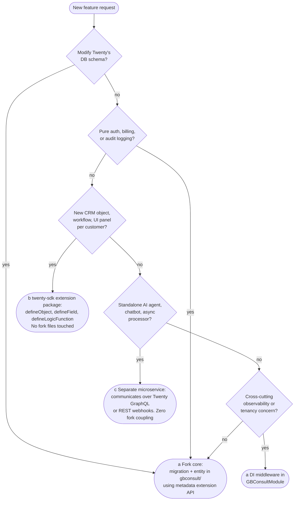

# ADR-002 — Twenty Fork Management

**Status:** Accepted
**Date:** 2026-05-10
**Deciders:** Guillaume

---

## Context

leCRM is a shallow AGPL fork of [twentyhq/twenty](https://github.com/twentyhq/twenty). Upstream ships every two weeks. The fork must stay close enough to upstream to absorb security patches and feature improvements, but not so coupled that every upstream merge becomes a multi-day rebase exercise. The constraints:

- **Solo operator.** Rebase budget ≤4 h/month.
- **Three to five files** of effective customization (auth/SSO, RLS interceptor, audit hook, enterprise-gate stub) — this is a shallow fork, not a hard fork.
- **AGPL §13** requires public availability of the source on the running service. The fork must be public on GitHub from day 1, with proper attribution.
- **License-change tail risk.** Twenty is YC-backed and dual-licensed (AGPL + commercial for `@license Enterprise` files). A future relicense (BSL, SSPL, or full proprietary) is non-zero probability over a 2-year horizon; the OpenTofu/Terraform precedent (HashiCorp BSL → community fork in 6 weeks) is the relevant playbook.
- Phase 1 → Phase 2 tenancy migration ([ADR-001](ADR-001-tenancy-model.md)) requires version parity across source VPSes and target shared cluster. The fork's release process must enable this.

The choices are:
- Branch strategy (long-lived fork main + per-release vs rolling rebase vs patch-overlay subtree).
- Patch isolation (in-place modification of core files vs DI provider override).
- Module-placement decision tree (which features go in core fork vs twenty-sdk extension vs separate microservice).
- Versioning scheme.
- AGPL §13 compliance mechanics.
- Contingency for license-ratchet.

---

## Decision

### 1. Branch strategy: rolling rebase, tag-gated

leCRM's `main` is rebased on top of selected upstream semver tags using the history-preserving variant (fake `merge -s ours` to join histories without altering tree, then `git rebase --onto`). Patches are atomic, single-purpose commits. Branch layout:

```
main                ← our production branch (patches on top of upstream)
upstream/main       ← remote tracking of twentyhq/twenty main
upstream/v2.X.Y     ← upstream release tags fetched as refs
release/lecrm-*     ← our own release tags
```

Cadence: monthly rebase sprint by default; security CVE in upstream or a Twenty dependency triggers an immediate rebase (target patch within 72 h). Fall-behind ceiling: 8 weeks (≈4 upstream releases). Beyond that, diff-blast risk balloons past the 4 h/month budget. (`docs/research/fork-management.md` §3.)

### 2. Patch isolation: NestJS DI provider override

All leCRM customizations live in `packages/twenty-server/src/engine/gbconsult/` as a NestJS module that exports replacement providers via the standard custom-providers pattern:

```typescript
// gbconsult/gbconsult.module.ts
@Module({
  imports: [CoreAuthModule],
  providers: [
    { provide: SSOService, useClass: GBConsultSSOService },
    { provide: RLSInterceptor, useClass: GBConsultRLSInterceptor },
    { provide: AuditHook, useClass: GBConsultAuditHook },
  ],
  exports: [SSOService, RLSInterceptor, AuditHook],
})
export class GBConsultModule {}
```

Exactly **one** touch-point in upstream code: a single import line in `packages/twenty-server/src/app.module.ts`:

```typescript
import { GBConsultModule } from './engine/gbconsult/gbconsult.module';
// ...
imports: [..., GBConsultModule], // last, so it shadows core providers
```

This file rarely changes upstream. The conflict surface across all of leCRM's customizations becomes one line in `app.module.ts` plus our own `gbconsult/` directory (which never conflicts because it's our content). (`docs/research/fork-management.md` §2.)

### 3. Module-placement decision tree

Embedded as a flowchart so the decision is reproducible for any new feature:



Rule of thumb: code that changes behaviour for **all** workspaces → (a). Code that enriches **one** workspace → (b). Code that never needs Twenty's internal state, only its public API → (c).

Concrete placements for known features:
- SSO override → (a) DI override in GBConsultModule
- RLS interceptor → (a) DI override
- Audit hook → (a) DI middleware
- Enterprise-gate stub → (a) DI override
- Custom CRM objects (per-client) → (b) twenty-sdk
- Custom workflow nodes → (b) twenty-sdk
- Email service / sequences engine → (c) separate microservice
- Agent runtime → (c) separate microservice
- Telegram / WhatsApp gateway → (c) separate microservice
- Voice pipeline → (c) separate microservice

### 4. Versioning scheme: `twenty-X.Y.Z+lecrm.N`

Semver 2.0 build metadata. Examples:
- `twenty-2.4.1+lecrm.0` — first leCRM release on top of Twenty 2.4.1.
- `twenty-2.4.1+lecrm.3` — third patch iteration on that base.
- `twenty-2.6.0+lecrm.0` — after rebasing to upstream 2.6.0.

Docker image tags substitute `-` for `+` (Docker doesn't accept `+`):
- `ghcr.io/gbconsult/lecrm:twenty-2.4.1-lecrm.0`

Precedent: Forgejo uses `X.Y.Z+gitea-A.B.C` for the same need. (`docs/research/fork-management.md` §5.)

Git tags: `git tag twenty-2.4.1+lecrm.0`, etc.

### 5. AGPL §13 compliance — published from day 1

Public repo: `github.com/gbconsult/lecrm` from the first commit. The repo contains the full Twenty fork plus our `gbconsult/` directory. The compliance checklist (`docs/research/fork-management.md` §6):

- `LICENSE` — AGPL-3.0 text verbatim at repo root, unmodified.
- `NOTICE` — `Copyright (c) Twenty, Inc.` (and other upstream NOTICE entries) + `Modifications Copyright (c) GB Consult SARL`.
- `README.md` — License & Attribution section: *"leCRM is a modified fork of [Twenty CRM](https://github.com/twentyhq/twenty), licensed under AGPLv3. Source code for all modifications is available at this repository. See LICENSE and NOTICE for details."*
- **UI footer** on every leCRM page served over the network: *"Powered by Twenty CRM (AGPL-3.0) — source: github.com/gbconsult/lecrm"* (this is the AGPL §13 "Appropriate Legal Notices" requirement).
- `@license Enterprise` headers on Twenty's commercial-licensed files are **not removed**. We do not redistribute commercial-licensed files; the gate stub in `gbconsult/` replaces commercial features functionally without copying their code.
- `CHANGES.md` or pinned GitHub compare link (`twentyhq/twenty...gbconsult/lecrm`) documenting what changed from upstream.
- The public repo must not be taken private or deleted while the service is running.

What AGPL does **not** require:
- We do not have to contribute patches upstream.
- We do not publish customer data, configs, or secrets.
- No special "AGPL compliance page" needed — the UI footer + public repo link is sufficient.

### 6. CLA-ratchet contingency: OpenTofu-style freeze playbook

**Trigger:** Twenty announces a license change affecting AGPL-covered files (BSL, SSPL, proprietary).

**Playbook:**

1. **Freeze.** Within 72 h of the announcement, tag the last AGPL-licensed upstream commit:
   ```bash
   git tag lecrm-agpl-freeze <last-agpl-commit-sha>
   git checkout -b lecrm-agpl-frozen lecrm-agpl-freeze
   ```
   `lecrm-agpl-frozen` becomes the production branch.

2. **Evaluate.** BSL typically has a Change Date (e.g., 4 years) that converts to Apache 2.0. If acceptable, frozen-mode is viable for that period.

3. **Maintenance-only mode on frozen branch:**
   - Security CVEs in frozen upstream: backport patches manually using NVD/CVE feeds (track via [GitHub Advisory Database](https://github.com/advisories)).
   - Dependency updates (NestJS, TypeORM, Passport) applied directly to frozen branch via `pnpm update`.
   - Estimated cost: +2 h/month security triage; +8 h/month if upstream has active CVE patching.

4. **Migration path** if frozen branch becomes untenable (>18 months of solo maintenance):
   - EspoCRM or SuiteCRM (both GPL) as alternative bases.
   - Our DI override pattern (decision §2) is what makes this migratable: the `gbconsult/` module is a self-contained set of providers that can be ported to a different NestJS-based CRM.

5. **Communications.** Within 7 days of freeze: notify all clients via email + status page; publish a public statement on `github.com/gbconsult/lecrm` documenting the freeze tag and maintenance commitment.

The OpenTofu precedent (HashiCorp BSL → CNCF fork in 6 weeks) is encouraging but cannot be matched by a solo operator. Our defensible posture is 18 months of maintenance-only mode, after which migration is cheaper than continuing.

---

## Consequences

### Positive

- **Diff hygiene.** DI override means our diff against upstream is essentially `gbconsult/*` (our content, no conflicts) plus one line in `app.module.ts` (rare upstream churn). Monthly rebases stay within the 4 h budget.
- **Module-placement clarity.** The decision tree means new features have a deterministic home. No agonizing per-feature "where does this live" debates.
- **AGPL §13 from day 1** keeps the legal posture clean. No retroactive scramble if a customer asks for source.
- **Versioning scheme** signals upstream lineage clearly to operators and future maintainers.
- **License-ratchet playbook** is a documented response, not improvised. The blast radius of a Twenty relicense is bounded to "switch to frozen branch within 72 h, maintenance-only for ≤18 months."

### Negative

- **DI override has subtle gotchas.** A core provider that uses `forwardRef()` or has provider-key collisions can be tricky to override. Each new override requires a brief verification that NestJS resolves to the leCRM provider (test harness asserts this).
- **One leak point in `app.module.ts`** is still a leak point. If upstream rewrites that file (rare but possible), the import line needs re-application.
- **Public repo from day 1** means competitors can read our customizations. This is required by AGPL §13 anyway and we don't have a competitive moat in the fork code (the moat is operational, see `docs/STRATEGIC-OVERVIEW.md` §4).
- **Frozen-branch maintenance is bounded.** ≤18 months. If Twenty relicenses early in our trajectory, the migration cost lands on a still-immature operation. Mitigation: keep (b) and (c) features (twenty-sdk extensions, separate microservices) healthy so they aren't fork-locked.

### Neutral

- The version-parity precondition for tenancy migration ([ADR-001](ADR-001-tenancy-model.md)) is satisfied by our release process: clients move forward in lockstep on tagged releases.
- AGPL §13 footer ("Powered by Twenty CRM") is a brand consideration but not a brand-burn. Plenty of B2B SaaS displays "Powered by ..." without conversion damage.

---

## Alternatives Considered

### Alt 1: Long-lived fork main + per-release branches (Option A in research)

Rejected. For a shallow fork, this adds branch ceremony without reducing conflict surface. Rolling rebase is simpler and gives the same outcome with fewer moving parts. (`docs/research/fork-management.md` §1 Option A.)

### Alt 2: Patch-overlay / git-subtree (Option C)

Rejected. Twenty is a Yarn workspace monorepo; git-subtree breaks workspace import resolution and adds tooling complexity disproportionate to the 3–5 file customization. (`docs/research/fork-management.md` §1 Option C.)

### Alt 3: In-place modification of core files (no DI override)

Rejected. Every upstream change to those files becomes a conflict surface. A 5-file in-place patch surface compounds rebase pain across 24+ upstream releases over a year. DI override collapses this to near-zero conflict surface. (`docs/research/fork-management.md` §2 sub-option A.)

### Alt 4: Stay 6+ months behind upstream

Rejected. At Twenty's bi-weekly cadence, 6 months = 24+ releases. Even with a shallow patch, architectural refactors in upstream (touching `app.module.ts`, `workspace.module.ts`) accumulate; catch-up rebase balloons past 4 h. The 8-week ceiling is the empirical sweet spot. (`docs/research/fork-management.md` §3.)

### Alt 5: Match Forgejo and become a hard fork

Rejected for the foreseeable future. Forgejo's hard-fork transition was driven by years of accumulated patches and architectural divergence. leCRM's surface is shallow and our value is operational, not architectural. Hard fork is a many-tens-of-hours-per-month commitment we cannot afford. The DI override pattern keeps us in soft-fork territory indefinitely. (`docs/research/fork-management.md` §8 Forgejo case study.)

### Alt 6: Use Twenty's commercial license to escape AGPL §13 obligations

Considered but not pursued at this time. Buying Twenty's commercial license relieves the AGPL obligation but introduces a dependency on a vendor relationship that complicates license-ratchet contingencies and adds a cost ceiling. AGPL §13 publication is a small operational task once set up. Reconsider if Twenty's Enterprise tier offers features we'd otherwise build ourselves and the price is justified.

---

## References

- `docs/research/fork-management.md` (entire document; §1 branch strategy, §2 patch isolation, §3 cadence, §4 module placement, §5 versioning, §6 AGPL compliance, §7 CLA-ratchet, §8 precedents).
- `docs/FEASIBILITY-MEMO.md` §2 (license posture, fork architecture).
- `docs/LEGAL-PLAYBOOK.md` §7 (AGPL §13 compliance details).
- [GitHub: Friend-zone strategies for fork management](https://github.blog/2022-05-02-friend-zone-strategies-friendly-fork-management/).
- [History-preserving fork maintenance with git](https://amboar.github.io/notes/2021/09/16/history-preserving-fork-maintenance-with-git.html).
- [NestJS Custom Providers](https://docs.nestjs.com/fundamentals/custom-providers).
- [AGPL-3.0 license text](https://www.gnu.org/licenses/agpl-3.0.en.html).
- [Forgejo: Forking forward](https://forgejo.org/2024-02-forking-forward/).
- [Forgejo versioning docs](https://forgejo.org/docs/next/user/versions/).
- [HashiCorp BSL announcement](https://discuss.hashicorp.com/t/hashicorp-projects-changing-license-to-business-source-license-v1-1/57106).
- [OpenTofu — what is it](https://scalr.com/learning-center/what-is-opentofu/).
- Related ADRs: [ADR-001](ADR-001-tenancy-model.md) (version parity required for tenancy migration), [ADR-005](ADR-005-ai-agent-tenancy.md) (agent runtime is a (c) microservice per the decision tree).

---

## TO RESOLVE

1. **Twenty CLA verification.** The brief states Twenty's LICENSE file contains no CLA reference, but contributor terms can change without a LICENSE file change. Track Twenty's `CONTRIBUTING.md` and `CLA.md` (if it appears) — our exposure to a CLA-ratchet rises if Twenty introduces one. Set up a GitHub watch on those paths.
2. **`@license Enterprise` file inventory.** Maintain an explicit list in `gbconsult/ENTERPRISE_FILES.md` of every Twenty file marked commercial. Pre-commit hook to fail builds if any of those files are modified or copied. Defends against accidental redistribution of commercial-licensed code.
3. **Test harness for DI overrides.** Build a single Jest test that asserts `app.get(SSOService)` returns `GBConsultSSOService` (and equivalent for each override). Runs on every PR. Catches a missed override after an upstream rebase.
4. **Frozen-branch security feed.** Subscribe to NVD / GitHub Security Advisories for `nestjs`, `typeorm`, `passport`, `node:*`. Define an alert workflow that triggers within 24 h of a CVE affecting our dependency tree. Required for the freeze contingency to be real.
5. **AGPL §13 footer wording approval.** Validate the exact UI footer string with `docs/LEGAL-PLAYBOOK.md` §7 before v0 ships. The wording must be unambiguous about the source link.
