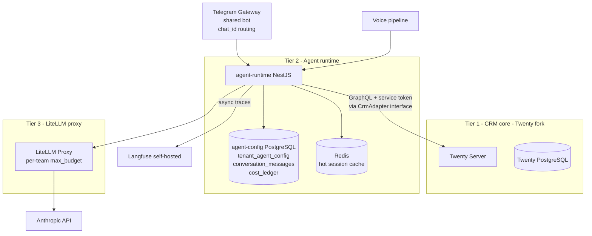

# ADR-005 — AI Agent Tenancy and Service Architecture

**Status:** Accepted
**Date:** 2026-05-10
**Deciders:** Guillaume

---

## Context

The strategic moat for leCRM is **AI-native interfaces** — chatbot-driven CRM, voice-driven CRM, autonomous pipeline-watching agents, LLM-powered dashboards (`docs/STRATEGIC-OVERVIEW.md` §4). v0 ships none of this; v2 (post first-five-clients-stable) is when this layer is built. This ADR captures the architecture so that v0 and v1 don't paint v2 into a corner.

The problems to solve:

1. **Where does per-tenant agent configuration live?** (system prompt, allowed tools, model tier, monthly cost cap) — Twenty workspace metadata, separate DB, or Redis?
2. **How is multi-turn conversation state managed across Telegram, voice, and the web admin UI?** (durability, hot cache, hand-off between agent and human)
3. **How does the agent runtime read and write CRM data?** (public Twenty GraphQL with rate limits vs internal NestJS API vs direct Postgres) — and what's the migration story?
4. **How are per-tenant cost caps enforced?** Hard caps required, soft warnings desired, billing pass-through must be calculable per-tenant.
5. **What's the chatbot tenancy model?** (per-tenant Telegram bots vs shared multi-tenant bot)
6. **How is per-tenant prompt caching exploited without leaking cross-tenant data?**

The constraints that shape the answers:

- **Solo operator.** One Telegram bot Guillaume operates is materially less ops than N per-client BotFather bot tokens, registrations, and renewals.
- **EU data residency.** Anthropic API egress must use the EU endpoint when available; Langfuse self-hosted in EU; LiteLLM in EU.
- **Fork hygiene** ([ADR-002](ADR-002-twenty-fork-management.md)). Agent runtime is a separate microservice (decision tree path (c)), not a fork modification.
- **Per-tenant cost transparency** for billing pass-through.

The research artefact `docs/research/ai-agent-tenancy-patterns.md` resolves most of the design questions; this ADR locks in the binding decisions for leCRM's specifics.

---

## Decision

### 1. Three-tier service architecture



**Tier 1 (Twenty fork core):** owns CRM data. No AI logic. Exposed only via its public GraphQL endpoint with workspace-scoped service tokens.

**Tier 2 (agent runtime):** new NestJS service, deployed as a Compose service alongside Twenty (phase 1) or as a separate container in the shared cluster (phase 2+). Owns conversation state, agent config, prompt construction, tool dispatch, cost reconciliation.

**Tier 3 (LiteLLM proxy):** standalone container. The only path from agent runtime to model providers. Enforces per-team budget caps server-side.

This split isolates the AI layer from the fork lifecycle ([ADR-002](ADR-002-twenty-fork-management.md) decision tree path (c)). Twenty rebases never break the agent runtime; agent runtime crashes don't take down the CRM.

### 2. Per-tenant agent config — separate Postgres + Redis cache

Agent config does **not** extend Twenty's schema. It lives in the agent-runtime's own PostgreSQL database. Rationale: Twenty's metadata API is for CRM-domain extensions (custom fields, custom objects); agent infrastructure config pollutes that domain and increases fork rebase pain. (`docs/research/ai-agent-tenancy-patterns.md` §2.)

```sql
CREATE TABLE tenant_agent_config (
  workspace_id       UUID PRIMARY KEY,
  system_prompt      TEXT NOT NULL,
  allowed_tools      TEXT[] NOT NULL DEFAULT '{}',
  model_tier         TEXT NOT NULL DEFAULT 'claude-haiku-4-5',
  monthly_cap_eur    NUMERIC(10,2),
  soft_warn_pct      SMALLINT DEFAULT 80,
  cache_seed_hash    TEXT,
  ledger_pass_through_pct  SMALLINT DEFAULT 40,  -- markup % for pass-through billing
  created_at         TIMESTAMPTZ DEFAULT NOW(),
  updated_at         TIMESTAMPTZ DEFAULT NOW()
);
```

Redis cache pattern: key `ws:{workspace_id}:agent_cfg`, value JSON of the row, TTL 5 min. On config change, the leCRM admin UI POSTs to agent-runtime's `/admin/invalidate-cache?workspace_id=...`, which DELETEs the Redis key.

### 3. Conversation state — Postgres durable + Redis hot cache

Two-layer model:

- **Redis hot cache:** key `conv:{conversation_id}:messages`, list of last 20 turns or 8,000 tokens (whichever first). TTL 24 h for Telegram conversations, 30 min for voice. Sub-100ms reads.
- **Postgres durable:** `conversation_messages(workspace_id, conversation_id, turn_index, role, content, model, tokens_in, tokens_out, created_at)`. Indexed on `(workspace_id, conversation_id, created_at)`. Source of truth for compliance, billing, conversation resumption.

**Write order:** Postgres first (synchronous), then Redis. Avoids the dual-write inconsistency where Redis succeeds and Postgres fails. (`docs/research/ai-agent-tenancy-patterns.md` §3.)

**Sliding window with anchored facts.** Every conversation prompt has three blocks:
1. **Static cached prefix** (~2,000 tokens, identical across all tenants on the same model tier).
2. **Per-tenant facts block** (workspace context: company name, industry, custom instructions, current user, open deals count, last sync timestamp).
3. **Sliding window of last N turns.**

The static prefix is the cache breakpoint. The facts block and history are not cached. Older turns fall out of the window naturally.

**Summarisation at threshold.** When a conversation reaches 30 turns, an LLM call summarises turns 1–20 into a paragraph stored in `conversation_summaries`. The agent then resumes with turns 21–30 + the summary as the facts block. Mirrors LangChain's `ConversationSummaryBufferMemory`.

**Hand-off suspend/resume.** When an admin takes over a conversation (admin UI button: "I'll handle this"), the agent runtime writes a `handoff_state` row containing the full context hash and `suspended_at`. On resume, rehydrate from Postgres → Redis → continue. Voice sessions always use suspend/resume because audio sessions can pause mid-utterance.

### 4. Internal API for agents — GraphQL + service token, with `CrmAdapter` interface

**v1 implementation (Option A in research):** agent runtime calls Twenty's public GraphQL endpoint with a workspace-scoped service token. Each workspace has a dedicated service token (Twenty-native API key) provisioned at agent-runtime onboarding. Twenty's existing role system contains damage to the workspace.

**Vendoring strategy:** the [Twenty MCP Server](https://github.com/mhenry3164/twenty-crm-mcp-server) (AGPL, community-maintained) is vendored into `agent-runtime/src/crm/twenty-mcp-vendor/` as the GraphQL client skeleton. Saves writing a GraphQL client + tool definitions from scratch.

**`CrmAdapter` interface for the future swap:**

```typescript
// agent-runtime/src/crm/crm-adapter.ts
export interface CrmAdapter {
  getContact(workspaceId: string, contactId: string): Promise<Contact>;
  searchContacts(workspaceId: string, query: string): Promise<Contact[]>;
  updateDealStage(workspaceId: string, dealId: string, stage: string): Promise<void>;
  createCallActivity(workspaceId: string, activity: CallActivityInput): Promise<Activity>;
  // ... other operations
}
```

**v1: `PublicGraphqlCrmAdapter`** implements the interface against Twenty's GraphQL.

**Future: `InternalNestJsCrmAdapter`** is a swap-in that talks to Twenty's Postgres directly (or via private GraphQL) bypassing public rate limits. It implements the same `CrmAdapter` interface; the agent-runtime's tool layer is unaware which adapter is bound.

**Trigger to graduate:** rate-limit pressure from bulk operations (e.g., a pipeline-watching agent scanning all open deals every hour for a workspace with thousands of deals). When throttling becomes user-visible (latency, missed events) or our error rate exceeds 0.5% on agent → CRM calls, build the internal adapter as a one-week project.

**Prompt-injection mitigation.** All CRM data retrieved by the agent (contact notes, email bodies, deal descriptions) passes through a sanitization step before being concatenated into the LLM context. Strip `[INSTRUCTION]`-like tokens, escape "Ignore previous instructions" patterns, never use raw CRM text in the `system` prompt — only in `user`-role messages with explicit framing. (`docs/research/ai-agent-tenancy-patterns.md` §4.)

### 5. Cost control — LiteLLM per-team `max_budget` + local cost ledger reconciler

**LiteLLM proxy** sits between agent-runtime and Anthropic. One LiteLLM team per leCRM workspace. `max_budget` per team in EUR (converted from USD at config time, refreshed monthly). LiteLLM enforces caps server-side and returns 429 when exceeded.

**Local cost_ledger table:**

```sql
CREATE TABLE cost_ledger (
  id                 BIGSERIAL PRIMARY KEY,
  workspace_id       UUID NOT NULL,
  ts                 TIMESTAMPTZ NOT NULL DEFAULT NOW(),
  model              TEXT NOT NULL,
  input_tokens       INTEGER NOT NULL,
  output_tokens      INTEGER NOT NULL,
  cache_read_tokens  INTEGER DEFAULT 0,
  cache_write_tokens INTEGER DEFAULT 0,
  amount_usd         NUMERIC(10,6) NOT NULL,
  amount_eur         NUMERIC(10,6) NOT NULL,
  conversation_id    UUID,
  source             TEXT NOT NULL  -- 'agent-turn', 'classifier', 'summariser', 'background'
);
CREATE INDEX idx_ledger_ws_ts ON cost_ledger(workspace_id, ts);
```

**Three-loop cost control:**

1. **Pre-flight:** agent runtime reads `current_month_spend(workspace_id)` from `cost_ledger` and rejects calls that would exceed `monthly_cap_eur` based on token estimation.
2. **In-flight:** LiteLLM enforces `max_budget` server-side; a 429 from LiteLLM is a hard wall that the agent runtime translates to a graceful "monthly AI budget reached" user message.
3. **Post-flight:** every 5 min, a reconciler calls Anthropic Admin API `/v1/organizations/usage_report/messages` and compares the per-workspace total (from Anthropic's `metadata.tags` if available, else from the LiteLLM team breakdown) against `cost_ledger.amount_usd`. Drift > 5% raises an alert; > 15% pages.

**Soft warning at 80% of cap:** admin notification in the leCRM admin UI ("AI budget at 82% — consider increasing the cap or reviewing usage").

**Billing pass-through:** the `tenant_billing_summary` table is written monthly with `total_cost_eur × (1 + ledger_pass_through_pct/100)` per tenant. Feeds the invoice generator. Default pass-through 40% margin; configurable per-tenant.

### 6. Two-block prompt caching pattern

Anthropic prompt caching: cache hits cost 0.1× base input price; writes cost 1.25× (5-min TTL) or 2.0× (1-hour TTL). Min cache size: 1,024 tokens for Haiku 4.5/Sonnet 4.5 (varies by model — confirm current values before each model upgrade). (`docs/research/ai-agent-tenancy-patterns.md` §6.)

**Block 1 (cached, static across tenants):**

```
You are a CRM assistant for a French SMB. Your role is to help users
manage their sales pipeline, log interactions, and retrieve contact
information. Always respond in the user's language (French or English).

Tools available: [tool definitions ~1,500 tokens]

[CACHE BREAKPOINT — cache_control: {type: "ephemeral"}]
```

This block is identical for **every** tenant on the same model tier. One cache entry serves all workspaces. Cache hit rate ≈ 100% after the first request per 5-min window across all tenants. **No cross-tenant data exposure** because the block contains no tenant data — only the system role and tool schemas.

**Block 2 (not cached, per-tenant):**

```
Workspace: {company_name}, industry: {industry}.
Custom instructions: {custom_instructions}.
Current user: {user_name}, role: {role}.
Open deals: {n}. Last sync: {ts}.
```

Per-tenant, per-session. Caching this would require a separate cache entry per tenant — not worth the write cost given the change frequency.

**Block 3 (conversation history):** Anthropic's automatic incremental caching advances the breakpoint with each turn. The static prefix is already cached; new turns accumulate cache hits naturally.

**TTL choice:**
- Telegram chatbot (sustained activity): 5-min TTL. Break-even after ~1.25 calls in the window. Trivially exceeded.
- Voice session (single burst, <5 min): 1-hour TTL. Higher write cost (2×) but the session completes before 5-min TTL would expire.

**Pre-warm at agent-runtime startup:** issue one `max_tokens: 0` call per active model tier per startup to populate the cache. Avoids cold-start latency on the first user message of the day.

### 7. Chatbot tenancy — shared multi-tenant bot

**Decision: Guillaume operates one Telegram bot** (`@leCRMBot` or post-rebrand equivalent) across all leCRM tenants. Per-tenant routing via a `chat_id_routing` table:

```sql
CREATE TABLE chat_id_routing (
  chat_id          BIGINT PRIMARY KEY,
  workspace_id     UUID NOT NULL,
  bound_user_id    UUID,         -- which Twenty user this Telegram chat speaks as
  bound_at         TIMESTAMPTZ NOT NULL DEFAULT NOW(),
  invite_token     TEXT
);
```

**Binding flow:**
1. Admin in leCRM UI generates an invite token for a user: "send `/start lc_{token}` to @leCRMBot."
2. User opens Telegram, runs `/start lc_{token}`.
3. Bot validates token, writes the row, confirms binding.

**Same pattern for WhatsApp Business** if added later: one Guillaume-operated number, per-tenant routing via `whatsapp_id_routing(phone_number, workspace_id, bound_user_id)`.

This avoids:
- Per-client BotFather provisioning (manual, doesn't automate cleanly).
- Per-client Telegram bot tokens in secrets management (multiplies secret rotation surface).
- Per-client WhatsApp Business number provisioning (significant cost and ops per number).

The trade-off: clients don't get a branded `@AcmeCRMBot` — they get `@leCRMBot`. For an SMB CRM this is acceptable. A future "Sovereign" SKU could offer per-client bots with explicit per-client BotFather setup.

---

## Consequences

### Positive

- **Service isolation.** Agent runtime can be rebuilt, redeployed, and rolled back independently of Twenty. v0/v1 ship without it; v2 layers on without touching the fork.
- **Cost containment is layered and verifiable.** LiteLLM enforces server-side; cost_ledger gives us per-workspace billing data; reconciler catches drift. A runaway agent loop has a hard ceiling.
- **CrmAdapter interface preserves migration optionality.** v1 GraphQL is the default; an internal adapter is a one-week project when needed, not a re-architecture.
- **Two-block prompt caching is privacy-clean.** The cached block contains no tenant data — one cache entry safely serves all tenants on the same model tier.
- **Shared Telegram bot collapses ops.** One bot to register, one webhook to monitor, one secret to rotate. End users get a clean `/start <token>` binding flow.
- **Conversation state is durable.** A worker crash never loses a session beyond the last 1–2 turns.

### Negative

- **Public GraphQL rate limits will bite at scale.** Bulk operations (autonomous pipeline-watching agents scanning thousands of deals) will hit Twenty's rate limits. The internal-adapter migration is the planned response, but it requires building.
- **Sanitization of CRM data is necessary, not optional.** A contact note with hostile content can trigger prompt injection. The sanitizer is a small but real attack surface; review needed.
- **Anthropic Admin API attribution is tag-based.** We pass `metadata.tags = {workspace_id}` on every call so the Admin API can attribute usage. If Anthropic changes the metadata schema, the reconciler breaks (TO RESOLVE).
- **Shared Telegram bot loses per-client branding.** Some clients may want their own bot handle. Deferred to a Sovereign SKU.
- **Two LLM proxy hops** (agent-runtime → LiteLLM → Anthropic) add ~10–30 ms latency per call. Acceptable for chat; voice agents might need direct Anthropic with a shadow ledger if latency becomes an issue (v2 perf review).

### Neutral

- The agent-config Postgres is small (one row per workspace + history of changes). Backup is trivial — included in the same WAL stream as Twenty's DB if co-located, or its own WAL stream if separate. Decision: phase 1 = same VPS, separate DB; phase 2 = shared cluster, separate database (`agent_config_db`) on the same PostgreSQL instance.
- Langfuse self-hosted is a soft requirement (one Langfuse project per workspace). If self-hosting becomes operationally heavy, an in-house simpler tracing solution can replace it; the trace data is decoupled from request path.
- The CrmAdapter interface adds one indirection layer in the agent-runtime code. Trivial cost; well worth it for migration optionality.

---

## Alternatives Considered

### Alt 1: Per-tenant Telegram bots (one BotFather token per client)

Rejected for v2. The per-client branding gain (`@AcmeCRMBot` vs `@leCRMBot`) is real but the operational cost is high: BotFather is a manual UI, automation is brittle, and per-client secret management compounds. A future Sovereign SKU can revisit. (`docs/research/ai-agent-tenancy-patterns.md` §8.)

### Alt 2: Direct Postgres access from agent-runtime (Option C in research)

Rejected. Maximum blast radius; bypasses all application-layer authorization; only auditable at Postgres WAL level. Acceptable only for read-only analytics queries behind a read replica, which is a separate concern handled by Metabase / Cube.dev. (`docs/research/ai-agent-tenancy-patterns.md` §4 Option C.)

### Alt 3: Internal NestJS service from day 1 (Option B in research)

Rejected for v1. We can't predict where rate-limit pressure will materialize. Building Option B speculatively burns weeks. The CrmAdapter interface gives us the migration path without the upfront cost. (`docs/research/ai-agent-tenancy-patterns.md` §4 Option B.)

### Alt 4: Store agent config in Twenty workspace metadata

Rejected. Twenty's metadata API is for CRM-domain schema extensions (custom fields, custom objects), and pollutes the CRM domain model with infrastructure concerns. Increases fork rebase pain and complicates the AGPL fork story. Separate database is cleaner. (`docs/research/ai-agent-tenancy-patterns.md` §2.)

### Alt 5: Per-tenant Anthropic Workspaces

Anthropic's Admin API supports per-workspace attribution and per-workspace API keys. Mapping one Anthropic Workspace per leCRM tenant is technically clean but doesn't scale: provisioning and managing 20+ Anthropic Workspaces is non-trivial admin overhead. The single-org + metadata-tag approach with LiteLLM team budgets gives us per-tenant attribution without per-tenant Workspace provisioning. (`docs/research/ai-agent-tenancy-patterns.md` §1.)

### Alt 6: Vercel AI SDK as the agent runtime framework

Considered. Vercel AI SDK 5 has clean separation of `UIMessage` / `ModelMessage` and good NestJS-friendly persistence hooks. But it's a JS-first framework that biases toward Vercel hosting. We'd carry framework-specific code that mixes inference and persistence. Building agent-runtime as a plain NestJS service with explicit `CrmAdapter` and explicit cost-ledger code is more portable and not significantly more work. Reconsider if Vercel AI SDK adds first-class self-hosted observability and per-team budget caps that match LiteLLM's.

---

## References

- `docs/research/ai-agent-tenancy-patterns.md` (entire document; §1 isolation, §2 config storage, §3 conversation state, §4 internal API, §5 cost control, §6 prompt caching, §7 service boundary diagram, §8 reuse vs build).
- `docs/STRATEGIC-OVERVIEW.md` §4 (AI-native moat — the strategic frame for this ADR).
- [Anthropic prompt caching](https://platform.claude.com/docs/en/docs/build-with-claude/prompt-caching).
- [Anthropic usage & cost API](https://platform.claude.com/docs/en/api/usage-cost-api).
- [LiteLLM proxy docs](https://docs.litellm.ai/).
- [Langfuse self-hosting](https://langfuse.com/self-hosting).
- [Twenty MCP Server (community)](https://github.com/mhenry3164/twenty-crm-mcp-server).
- [Twenty CRM APIs](https://docs.twenty.com/developers/extend/capabilities/apis).
- Related ADRs: [ADR-001](ADR-001-tenancy-model.md) (workspace_id is the per-tenant key throughout), [ADR-002](ADR-002-twenty-fork-management.md) (agent runtime is a separate microservice per the decision tree), [ADR-003](ADR-003-email-provider-brevo.md) (sequences engine cost ledger uses the same accounting), [ADR-007](ADR-007-encryption-secrets-audit.md) (per-tenant Anthropic API keys, OAuth secrets, namespaced in Vault).

---

## TO RESOLVE

1. **Anthropic EU endpoint and DPF posture.** Confirm the EU endpoint URL, the data-residency commitment in Anthropic's DPA, and the DPF certification status before sending any production CRM data through the agent runtime. If the EU endpoint isn't yet GA, document the SCC fallback in the leCRM client DPA.
2. **Anthropic metadata schema for per-workspace attribution.** Validate that `metadata.tags = {workspace_id}` (or equivalent) is recognised by the Admin API for filtering. If not, the reconciler must rely on LiteLLM team breakdown only — coverage gap if LiteLLM is bypassed for any reason.
3. **CrmAdapter migration trigger criteria.** The current criterion is "rate-limit error rate > 0.5% on agent → CRM calls." Refine after first 1,000 agent turns in production — may need a more nuanced threshold (e.g., differentiate burst-rate vs sustained-rate).
4. **Sanitization library.** Choose: a custom regex-based sanitizer, or a known library (e.g., `prompt-injection-defender`). Custom is simpler and doesn't add a dependency surface; library is better-tested. Lean custom for v1, library for v2 if attacks materialize.
5. **Per-tenant Langfuse project provisioning automation.** Langfuse self-hosted Admin API supports project creation, but the workflow integrates with our onboarding script — needs a small wrapper. Defer until v2 build but track as a known onboarding-script TODO.
6. **Voice latency budget vs LiteLLM proxy hop.** Voice agents are latency-sensitive (sub-1s end-to-end is the user-perceived threshold). If LiteLLM hop adds >50 ms p95, evaluate a "fast-lane" direct Anthropic path for voice with shadow ledger writes. Decision after voice prototype measurements.
7. **Cross-tenant prompt-cache leakage audit.** Although the cached static block contains no tenant data by design, document a test that confirms this empirically: assert that the cached prompt body is byte-identical across two tenants' sessions before each model upgrade.
