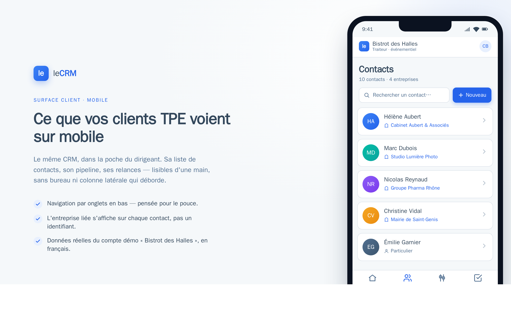

# leCRM — demo deck assets

Slide assets for the Léo integrator demo. The live demo itself is **desktop**
(`https://demo.lecrm.gbconsult.me`); these are framed artifacts for the parts
of the story that aren't live yet.

## Slides

### Slide — « Ce que vos clients TPE voient sur mobile »



**One framed phone mockup** of the client-facing surface (the contacts list) as
it *should* look on a 390 px phone, for the TPE-client mobile story Léo is
buying into. It is a **sales asset, not shipped responsive code** — the real
responsive shell is the post-demo task (`lecrm-leo-demo-polish` step 11).

Why this slide exists: mobile is **out of Léo's live desktop demo**, but the
"your TPE clients carry their CRM in their pocket" promise is central to the
pitch. This gives him one tangible artifact without spending a sprint on
responsive code.

What it deliberately mirrors from the real product (so it stays honest):

- **Tokens** from `apps/web/src/index.css` — HubSpot-inspired canvas `#F5F8FA`,
  slate ink `#33475B`, primary `#2563EB`, teal/amber accents.
- **Real seeded data** from the `bistrot-halles` demo workspace
  (`deploy/seed/demo-bistrot-halles.sql`): Hélène Aubert / Cabinet Aubert &
  Associés, Marc Dubois / Studio Lumière Photo, etc.
- **The relationship fix** (step 1): every contact row shows the **linked
  company name**, not a raw UUID — and an individual reads "Particulier".
- **French chrome** (step 5): "Contacts", "Nouveau", "Rechercher un contact…".
- **The planned mobile shell** (step 11): a thumb-reachable **bottom tab bar**
  (Accueil · Contacts · Pipeline · Tâches) — the responsive direction, not the
  current always-rendered `w-64` sidebar that the UX review flagged as broken on
  mobile (finding A.1).

#### Regenerating the PNG

The source is `assets/mobile-client-surface.html` (self-contained, no build).
Render at 2× with headless Chrome. The host shell's 6 GB `ulimit -v` SIGTRAPs
Chromium, so render inside the Playwright container (same trick as the demo
walkthrough proof):

```bash
sg docker -c "docker run --rm -v \$PWD:/work \
  mcr.microsoft.com/playwright:v1.58.2-noble bash -lc \
  'cd /work/docs/demo-deck/assets && \
   /ms-playwright/chromium-1208/chrome-linux64/chrome --headless=new \
   --no-sandbox --disable-gpu --force-device-scale-factor=2 \
   --window-size=1280,800 --screenshot=mobile-client-surface.png \
   file:///work/docs/demo-deck/assets/mobile-client-surface.html'"
```
